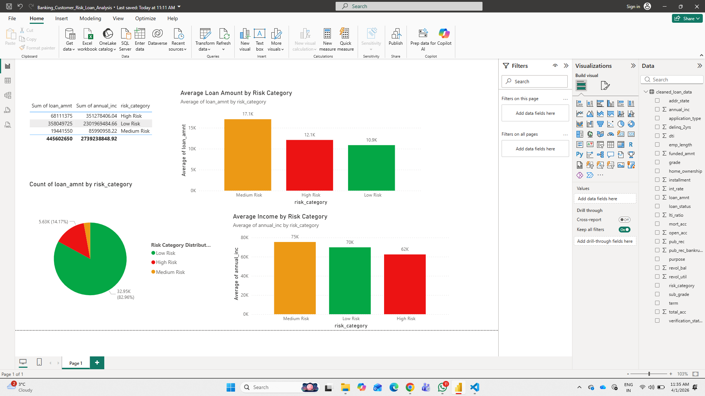

# 📊 Banking Customer Risk Loan Analysis

## 🚀 Project Overview

This project analyzes customer loan data to identify risk patterns using Power BI.
The goal is to help financial institutions understand borrower behavior and make better lending decisions.

---

## 📌 Key Insights

* Low-risk customers dominate the dataset (~83%)
* Medium-risk customers have the highest loan amounts
* High-risk customers have comparatively lower income
* Clear relationship between income and loan risk

---

## 🛠️ Tools & Technologies

* Power BI
* Python
* Pandas
* Excel

---

## 📂 Project Files

* `Banking_Customer_Risk_Loan_Analysis.pbix`
* Dataset file
* Dashboard images

## 📂 Project Structure
* Banking-Customer-Risk-Loan-Analysis/
* │
* ├── dashboard/
* │   └── Banking_Customer_Risk_Loan_Analysis.pbix
* │
* ├── data/
* │   ├── raw/
* │   └── processed/
* │
* ├── notebooks/
* │   └── loan_analysis.ipynb
* │
* ├── dashboard.png
* ├── README.md
* ├── requirements.txt

---
## ⚙️ Setup Instructions (Optional – for data processing)
* 1. Create Virtual Environment
* python -m venv .venv

* Activate environment:

* .venv\Scripts\activate   # Windows
* 2. Install Dependencies
* pip install -r requirements.txt
* 3. Run Notebook
* jupyter notebook

* Open:

* loan_analysis.ipynb

---

## 🎯 Business Value

* Helps identify high-risk customers
* Improves loan approval decisions
* Supports data-driven banking strategies

---

## 📊 Dashboard Preview

